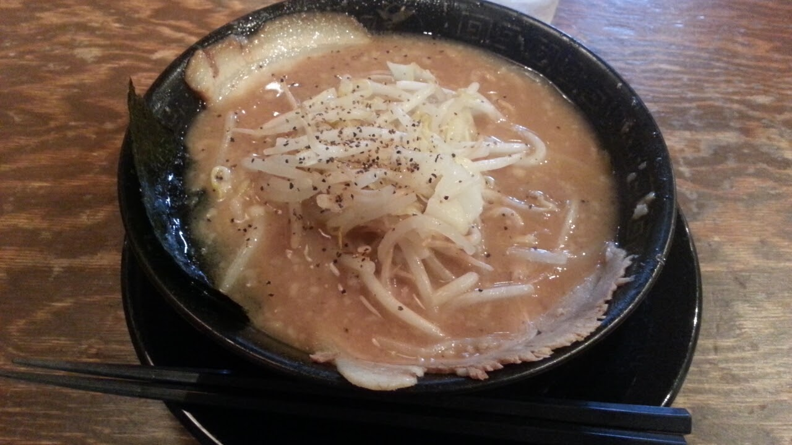

# 自己紹介
## 永徳 泰明
## (一太郎)
-------------
## プロフィール
</img>

- 氏名: 永徳 泰明
- 出身地: 京都(嵐山)
- 誕生日: 1991/9/18
- DiSCはCD
-------------
## プロフィール
</img>

- 氏名: 永徳 泰明
- 出身地: 京都(嵐山)
- 誕生日: 1991/9/18
- DiSCはCD
-------------

-------------
<!-- .slide: data-background-image="img/arashiyama.jpg" -->
-------------
## 好きな食べ物
  + 牡蠣、牛丼、🍻、ラーメン
-------------
</img>
</img>
</img>
</img>
</img>
-------------
## 趣味
  + アニメ, 漫画
  + 最近ジムに行き始めた
  + デジタルガジェット
  + ミニマリストに憧れ
  + プログラミング…？
-------------
# 成長記録
</img>
-------------
## 小学校時代
- 一言で言うと問題児
-------------
## 小学校時代
- 一言で言うと問題児
  + ストーブの上に紙飛行機を飛ばしその冬はストーブ中止に
  + 図鑑大好き あだ名はハカセ
  + メガネを2連続で壊しインドア派へ
  </img>
  </img>
-------------
## 中学・高校
- 中高一貫校に進学
</img>
-------------
<!-- .slide: data-background-image="img/syugaku.jpg"-->
-------------
<!-- .slide: data-background-image="img/yama.jpg"-->
-------------
<!-- .slide: data-background-image="img/yama2.jpg"-->
-------------
### 中学・高校
- 中高一貫校に進学

→ 落ちこぼれてしまい悩む
</img>
-------------
理想: 高校受験に悩まされず好きな勉強(理科)に打ち込める！
</img>
-------------
現実: テストの数字ばかりを気にする毎日
</img>
-------------
## 大学進学
-------------
## 大学進学
### と思いきや…
<!-- .slide: data-background="grey" -->
-------------
## 1年の浪人生活
<!-- .slide: data-background="black" -->
- 努力しても数字が出ない
- 朝から晩まで予備校は精神的にも体力的にも厳しい
- 勉強(特に座学)が嫌いに
-------------
## ようやく大学に
 - 京都工芸繊維大学 工芸科学部 情報工学課程
   + のち情報通信システム研究室所属
 </img>
-------------
## 行けたものの…
- 精神も生活習慣もガタガタ
- 弱い自分と向き合えなかった
-------------
</img>
-------------
<!-- .slide: data-background-image="img/daigaku.jpg"-->
-------------
## そんな中で
-------------
# プログラミングとの出会い(再会?)

-------------
## ライフゲーム
- 生物部の後輩が自力で作成したのがきっかけ
</img>
------------
## 作ったもの
------------
## Wikiクローン
- レガシーなPHP → モダンフレームワークPHPに移行
</img>
------------
## 部室なう
- 部室の入退室管理アプリ
- 鍵の貸し借りがめんどいという会話から生まれた
- 3日で実装
</img>
------------
## カオパネ
- Yahooハッカソンで作成
</img>
------------
<!-- .slide: data-background-image="img/kaopane1.png" data-background-size="contain;"-->
------------
<!-- .slide: data-background-image="img/kaopane2.png" data-background-size="contain;"-->
------------
## アルバイト
- サークルのOBが社長をやっている小さな会社で4年ほど修行
  + 受託開発案件中心
  + PHP, JavaScript, C++, Java, Lisp, ...
  + お金はないが自由な空気
  </img>
------------
## 就活
- 世の中に新しい価値を提供している企業かどうか
  + 自分が本気でコミットできるような面白いサービス
- エンジニアを大切にしている企業か
------------
### paizaでの就活
</img>
-------------
# 自分にとってプログラミングとは
-------------
# 人生
-------------
# <s>人生</s>
-------------
自分にとってプログラミングとは
- 社会に貢献するための**手段**
 - 社会(半径5mにいる人から世界まで)
 - 今たまたま人よりも優れている
 - 一番好きなもの
-------------
### 失敗からの気づき
- なんだかんだ自分は寂しがり
- 高校時代一番欠けていたのは主体性
-------------
# 自分ならではの形で社会に貢献したい！
